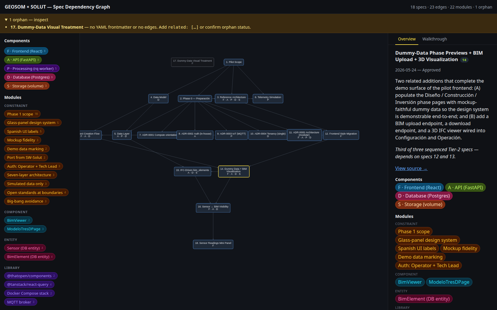

# spec-graph

A Claude Code plugin that turns a directory of **spec markdown files** into an
**interactive dependency-graph viewer** — a single self-contained HTML page you
open in a browser, click through, and read.

It is a set of *agent skills*, not a CLI or library. There is nothing to
install into your project and no build step: Claude reads your specs, extracts
the data, and writes one HTML file.



## What's inside

Three composable skills:

| Skill | Does |
|-------|------|
| **spec-dag** | Discovers a spec corpus and parses it into a dependency **DAG** — nodes, edges (from `related:` frontmatter), orphans, a topological ordinal, and warnings. Useful on its own (e.g. a text or Mermaid dependency report). |
| **spec-annotations** | *Optional* enrichment: a **modules** ontology (cross-cutting concerns), a **layers/components** taxonomy, and per-section **walkthrough** tags. Drives the filter rails and the readable section view. |
| **spec-graph-viewer** | Renders the DAG (plus any annotations) into the self-contained interactive **HTML** — force/breadthfirst graph, click-to-read side panel, and AND-combined Components + Modules filter rails. |

Typical flow: `spec-dag` → (optional `spec-annotations`) → `spec-graph-viewer`.
Each skill **asks you** for what it needs rather than assuming your
conventions — where your specs live, what your frontmatter looks like, whether
you keep a taxonomy file, and where to write the output.

## Install

```
/plugin marketplace add franciscoandrades/spec-graph
/plugin install spec-graph@spec-graph
```

(The `@spec-graph` suffix is the marketplace name. Add via a **git** URL/owner-repo, not a direct link to `marketplace.json`, so the relative plugin source resolves.)

Then just ask Claude: *"build a spec graph for my specs in `docs/specs/`"* (or
*"show me how my specs depend on each other"*).

## What a "spec" looks like

The skills work with markdown files that carry a little YAML frontmatter. This
is **one supported example** — the skills will ask you to confirm or describe
your own format:

```yaml
---
title: My spec
date: 2026-01-15
status: Approved
type: spec
related:
  - 2026-01-10-prerequisite
  - id: 2026-01-12-other
    because: "needs the endpoint that spec introduces"
---

> **Purpose / Status.** One paragraph describing what this spec is and why.

## §1 Motivation
…
```

- `related:` is the dependency edge list (bare id, or `{id, because}` for an
  edge label). Edges point successor → predecessor.
- The first description blockquote becomes the node's summary.
- A file with no frontmatter triggers an offer to **generate the frontmatter
  for you** by reading the spec (inferring title and `related:` dependencies
  from the prose, for you to confirm); decline and it's included as an **orphan**
  with a warning.

## Customization

Nothing is hardcoded to a particular stack. The **modules** type palette and
the example **layers** set ship as overridable defaults. To pin a taxonomy,
add a `modules.yaml` and/or `layers.yaml` next to your specs, or put `modules:`
/ `layers:` lists in each spec's frontmatter — otherwise the skill infers them
and asks you to confirm.

## License

MIT — see [LICENSE](LICENSE).
